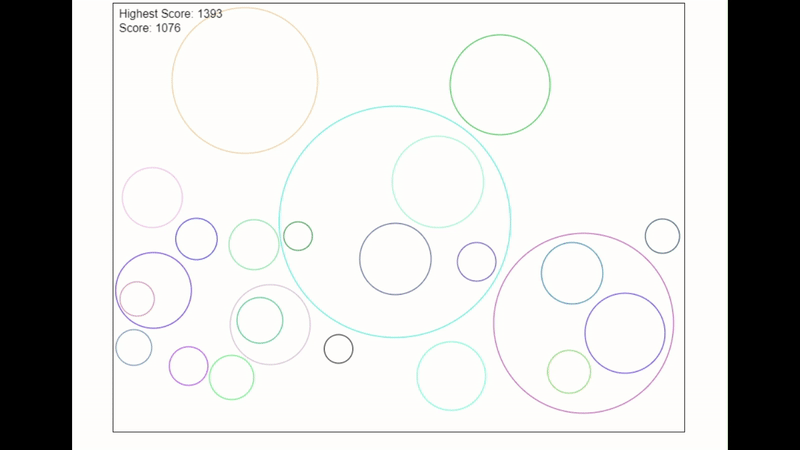
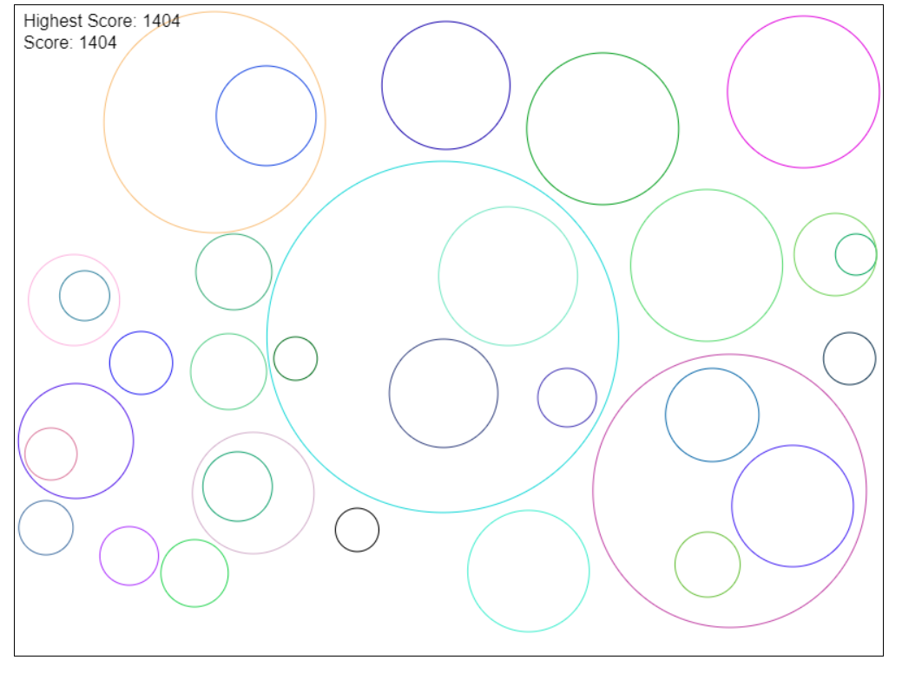

# Circle Game

Welcome to the Circle Game! Dive into the gaming experience [here](https://uliba3.github.io/CircleGame/).

## How to Play

1. **Access the Game:** Click on the [Circle Game link](https://uliba3.github.io/CircleGame/) to launch the game in your web browser.

2. **Interact with the Game:**
   - **Space/Enter Key/Mouse Click:** Stop where you want to place your circle. Click again to determine its size.

3. **Objective:**
   - Grow your circles as large and numerous as possible.

## Gameplay Features

- Place your circles strategically.
- Your circle grows in size.
- Collisions with the canvas edges or other circles result in the end of the game.
- The score is displayed on the screen, and the highest score achieved is stored locally.

## Technical Details

### HTML and CSS

- The game's basic structure is defined in `index.html` using the canvas element.
- CSS styles center the canvas and provide a border.

### JavaScript (script.js)

- Game logic, implemented in JavaScript, includes components like the player's circle, an array for falling circles, game states, input handling, collision detection, and local storage for the highest score.

## Local Storage

- The game uses local storage to persist the highest score across sessions.
- Any new high score achieved will be stored and displayed in subsequent plays.

## Game Over and Reset

- When the game concludes, due to collisions or manual triggering, the `gameOver` function activates.
- It updates the highest score, briefly transitions the game state to "Game Stop," and then sets the condition to "Game Over."
- The `reset` function initializes the game for a new round.

Explore the code, make modifications, and enhance the game further! Enjoy playing the Circle Game!
